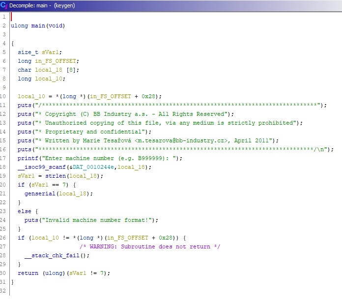
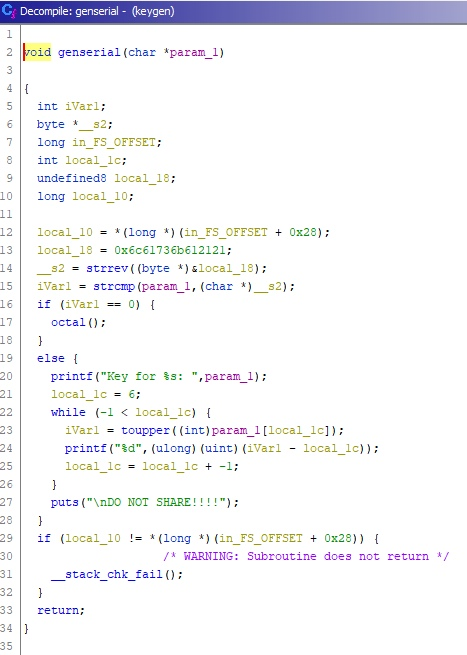

# Key generator (300 points)

## Description

This is our official key generator that we use to derive keys from machine numbers. Our developer put a secret in its code. Can you find it?

[Attached file](keygen)

## Solution

This is my second stf where I decided to do tasks related to reverse engineering. First of all, we check the file type:
```shell
$ file keygen
keygen: ELF 64-bit LSB shared object, x86-64, version 1 (SYSV), dynamically linked, interpreter /lib64/ld-linux-x86-64.so.2, BuildID[sha1]=7d6f8eb010acea04bfdcbeef39b6fa8df52ec9bf, for GNU/Linux 3.2.0, not stripped
```
Now let's start decompiling with [ghidra](https://ghidra-sre.org/InstallationGuide.html) and open main function:


Machine number should be 7 characters long. Now I need to open the function that generates the serial number:


You can see that __s2 is a reversed string (14 line, function **strrev**) that is located in memory. Then our input is compared with __s2 (15 line, function **strcmp**), and if the reversed line from memory and our input are equal, we go to the next function octal which in turn generates the key we need.

It's time to start using the [**gdb-peda**](https://github.com/longld/peda) utility to run the file.
```shell
$ gdb ./keygen
```
First of all I need to load all the functions by running the program (type **r**). Now let's disasemble genserial function:
```shell
gdb-peda$ disas genserial
Dump of assembler code for function genserial:
   0x00005555555552d8 <+0>:     push   rbp
   0x00005555555552d9 <+1>:     mov    rbp,rsp
   0x00005555555552dc <+4>:     sub    rsp,0x30
   0x00005555555552e0 <+8>:     mov    QWORD PTR [rbp-0x28],rdi
   0x00005555555552e4 <+12>:    mov    rax,QWORD PTR fs:0x28
   0x00005555555552ed <+21>:    mov    QWORD PTR [rbp-0x8],rax
   0x00005555555552f1 <+25>:    xor    eax,eax
   0x00005555555552f3 <+27>:    movabs rax,0x6c61736b612121
   0x00005555555552fd <+37>:    mov    QWORD PTR [rbp-0x10],rax
   0x0000555555555301 <+41>:    lea    rax,[rbp-0x10]
   0x0000555555555305 <+45>:    mov    rdi,rax
   0x0000555555555308 <+48>:    call   0x555555555199 <strrev>
   0x000055555555530d <+53>:    mov    rdx,rax
   0x0000555555555310 <+56>:    mov    rax,QWORD PTR [rbp-0x28]
   0x0000555555555314 <+60>:    mov    rsi,rdx
   0x0000555555555317 <+63>:    mov    rdi,rax
   0x000055555555531a <+66>:    call   0x555555555080 <strcmp@plt>
   0x000055555555531f <+71>:    test   eax,eax
   0x0000555555555321 <+73>:    je     0x55555555538c <genserial+180>
   0x0000555555555323 <+75>:    mov    rax,QWORD PTR [rbp-0x28]
   0x0000555555555327 <+79>:    mov    rsi,rax
   0x000055555555532a <+82>:    lea    rdi,[rip+0xf37]        # 0x555555556268
   0x0000555555555331 <+89>:    mov    eax,0x0
   0x0000555555555336 <+94>:    call   0x555555555070 <printf@plt>
   0x000055555555533b <+99>:    mov    DWORD PTR [rbp-0x14],0x6
   0x0000555555555342 <+106>:   jmp    0x555555555378 <genserial+160>
   0x0000555555555344 <+108>:   mov    eax,DWORD PTR [rbp-0x14]
   0x0000555555555347 <+111>:   movsxd rdx,eax
   0x000055555555534a <+114>:   mov    rax,QWORD PTR [rbp-0x28]
   0x000055555555534e <+118>:   add    rax,rdx
   0x0000555555555351 <+121>:   movzx  eax,BYTE PTR [rax]
   0x0000555555555354 <+124>:   movsx  eax,al
   0x0000555555555357 <+127>:   mov    edi,eax
   0x0000555555555359 <+129>:   call   0x555555555030 <toupper@plt>
   0x000055555555535e <+134>:   sub    eax,DWORD PTR [rbp-0x14]
   0x0000555555555361 <+137>:   mov    esi,eax
   0x0000555555555363 <+139>:   lea    rdi,[rip+0xcb6]        # 0x555555556020
   0x000055555555536a <+146>:   mov    eax,0x0
   0x000055555555536f <+151>:   call   0x555555555070 <printf@plt>
   0x0000555555555374 <+156>:   sub    DWORD PTR [rbp-0x14],0x1
   0x0000555555555378 <+160>:   cmp    DWORD PTR [rbp-0x14],0x0
   0x000055555555537c <+164>:   jns    0x555555555344 <genserial+108>
   0x000055555555537e <+166>:   lea    rdi,[rip+0xef0]        # 0x555555556275
   0x0000555555555385 <+173>:   call   0x555555555040 <puts@plt>
   0x000055555555538a <+178>:   jmp    0x555555555396 <genserial+190>
   0x000055555555538c <+180>:   mov    eax,0x0
   0x0000555555555391 <+185>:   call   0x55555555523e <octal>
   0x0000555555555396 <+190>:   nop
   0x0000555555555397 <+191>:   mov    rax,QWORD PTR [rbp-0x8]
   0x000055555555539b <+195>:   sub    rax,QWORD PTR fs:0x28
   0x00005555555553a4 <+204>:   je     0x5555555553ab <genserial+211>
   0x00005555555553a6 <+206>:   call   0x555555555060 <__stack_chk_fail@plt>
   0x00005555555553ab <+211>:   leave
   0x00005555555553ac <+212>:   ret
End of assembler dump.
```

I need to place breakpoint at first printf function according to the decompiled genserial code:
```shell
gdb-peda$ b *0x0000555555555336
Breakpoint 1 at 0x555555555336
```
Let's run the program again
```shell
gdb-peda$ r
Starting program: /mnt/d/Downloads/keygen
/********************************************************************************
* Copyright (C) BB Industry a.s. - All Rights Reserved
* Unauthorized copying of this file, via any medium is strictly prohibited
* Proprietary and confidential
* Written by Marie Tesařová <m.tesarova@bb-industry.cz>, April 2011
********************************************************************************/

Enter machine number (e.g. B999999): 9999999
[----------------------------------registers-----------------------------------]
RAX: 0x0
RBX: 0x555555555490 (<__libc_csu_init>: endbr64)
RCX: 0xffff01ff
RDX: 0x6c ('l')
RSI: 0x7fffffffe520 --> 0x39393939393939 ('9999999')
RDI: 0x555555556268 ("Key for %s: ")
RBP: 0x7fffffffe510 --> 0x7fffffffe530 --> 0x0
RSP: 0x7fffffffe4e0 --> 0x5555555563d0 ('*' <repeats 80 times>, "/\n")
RIP: 0x555555555336 (<genserial+94>:    call   0x555555555070 <printf@plt>)
R8 : 0x39 ('9')
R9 : 0x7c ('|')
R10: 0x5555555544ab --> 0x5f00706d63727473 ('strcmp')
R11: 0x7ffff7f49b60 (<__strcmp_avx2>:   endbr64)
R12: 0x5555555550a0 (<_start>:  endbr64)
R13: 0x7fffffffe620 --> 0x1
R14: 0x0
R15: 0x0
EFLAGS: 0x282 (carry parity adjust zero SIGN trap INTERRUPT direction overflow)
[-------------------------------------code-------------------------------------]
   0x555555555327 <genserial+79>:       mov    rsi,rax
   0x55555555532a <genserial+82>:       lea    rdi,[rip+0xf37]        # 0x555555556268
   0x555555555331 <genserial+89>:       mov    eax,0x0
=> 0x555555555336 <genserial+94>:       call   0x555555555070 <printf@plt>
   0x55555555533b <genserial+99>:       mov    DWORD PTR [rbp-0x14],0x6
   0x555555555342 <genserial+106>:      jmp    0x555555555378 <genserial+160>
   0x555555555344 <genserial+108>:      mov    eax,DWORD PTR [rbp-0x14]
   0x555555555347 <genserial+111>:      movsxd rdx,eax
Guessed arguments:
arg[0]: 0x555555556268 ("Key for %s: ")
arg[1]: 0x7fffffffe520 --> 0x39393939393939 ('9999999')
[------------------------------------stack-------------------------------------]
0000| 0x7fffffffe4e0 --> 0x5555555563d0 ('*' <repeats 80 times>, "/\n")
0008| 0x7fffffffe4e8 --> 0x7fffffffe520 --> 0x39393939393939 ('9999999')
0016| 0x7fffffffe4f0 --> 0x555555555490 (<__libc_csu_init>:     endbr64)
0024| 0x7fffffffe4f8 --> 0x7fffffffe530 --> 0x0
0032| 0x7fffffffe500 --> 0x2121616b73616c ('laska!!')
0040| 0x7fffffffe508 --> 0xc206183b2e7f5500
0048| 0x7fffffffe510 --> 0x7fffffffe530 --> 0x0
0056| 0x7fffffffe518 --> 0x555555555466 (<main+185>:    mov    eax,0x0)
[------------------------------------------------------------------------------]
Legend: code, data, rodata, value

Breakpoint 1, 0x0000555555555336 in genserial ()
```

**0032| 0x7fffffffe500 --> 0x2121616b73616c ('laska!!')** What is it? Let's try **laska!!** as a machine number
```shell
gdb-peda$ r
Starting program: /mnt/d/Downloads/keygen
/********************************************************************************
* Copyright (C) BB Industry a.s. - All Rights Reserved
* Unauthorized copying of this file, via any medium is strictly prohibited
* Proprietary and confidential
* Written by Marie Tesařová <m.tesarova@bb-industry.cz>, April 2011
********************************************************************************/

Enter machine number (e.g. B999999): laska!!
1639171916391539162915791569103912491069173967911091119123955915191639156967955916396391439125916296395591439609104911191169719175
You are not done yet! ಠ‿ಠ
[Inferior 1 (process 224) exited normally]
Warning: not running
```

I got a long number and a phrase that is not all. At this point, I absolutely did not know what to do with this number, and spent about 6 hours trying different combinations on a cyberchef. I decided to open a hint and this is what it looked like:

```
Hint

0–7
```
This tip didn't give me anything, but my teammate solved the problem by replacing each 9 with space (0-7 meant an octal). As a result, the line became like this:
```
163 171 163 153 162 157 156 103 124 106 173 67 110 111 123 55 151 163 156 67 55 163 63 143 125 162 63 55 143 60 104 111 116 71 175
```
We put this line in the [cyberchef](http://icyberchef.com/), use the magic method and look for "CTF". Method From_Octal('Space') gives us flag.

Flag syskronCTF{7HIS-isn7-s3cUr3-c0DIN9}