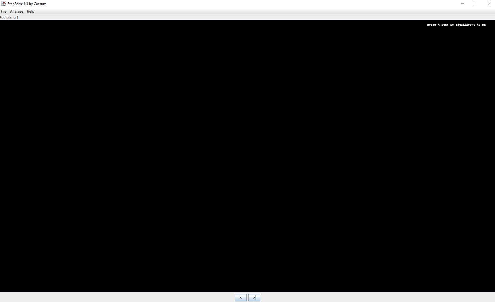
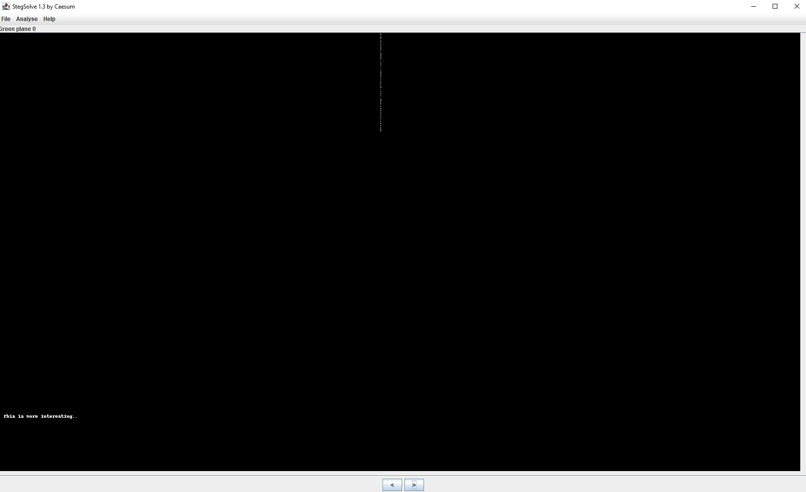
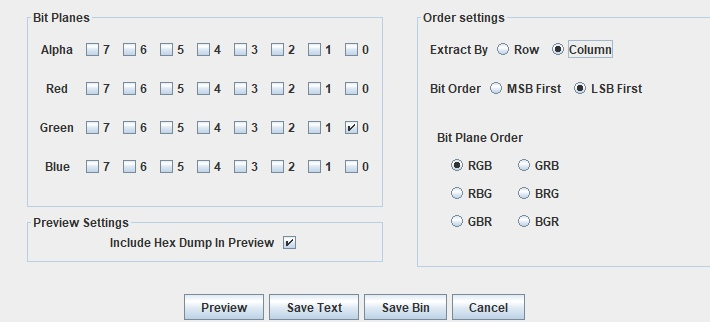

# Screenshot (300 points)

## Description

After a hacking attack, we have fetched some suspicious e-mails sent from within Senork Vertriebs GmbH to an unknown recipient. It has an attachment and says, "Hi, I managed to capture a screenshot. I am sure there is something useful for us in there, even if it's not that significant. Good luck".

What could that be?

[Attached image](https://github.com/holypower777/ctf_writeups/blob/main/syskronCTF_2020/screenshot/Screenshot_2020-05-19_at_11.38.08_AM.png)

## Solution

Having tried all the standard steganography utilities, such as binwalk, strings, pngcheck, zsteg, I decided to open stegsolve

I started to change the planes and on the red plane 1 we can see the following:

"Doesn't seem so significant to me", Okay, that's interesting... let's continue

"This is more interesting"

This line in the center looks like the Least Significant Bit (LSB). At this stage, I did not know what to do and began to read writeups on that topic. In the process of reading, I tried many python scripts to solve the task, but the solution turned out to be very easy.

Let's open stegsolve again and press the **Data Extract**, then select the desired bit plane (green 0), select the **LSB first** bit order and **Extract By** Column and save it as a bin.

Let's see the output

Flag: syskronCTF{s3cr3T_m3sS4g3}
