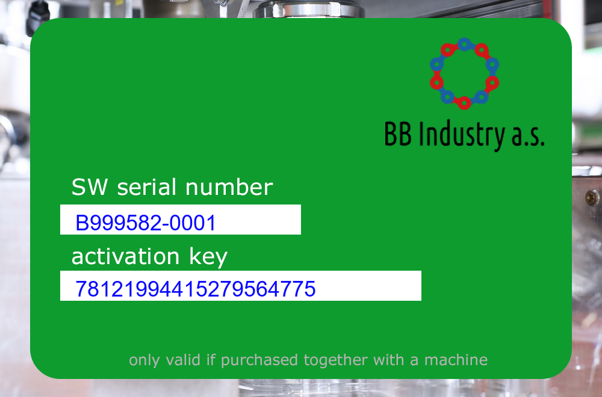
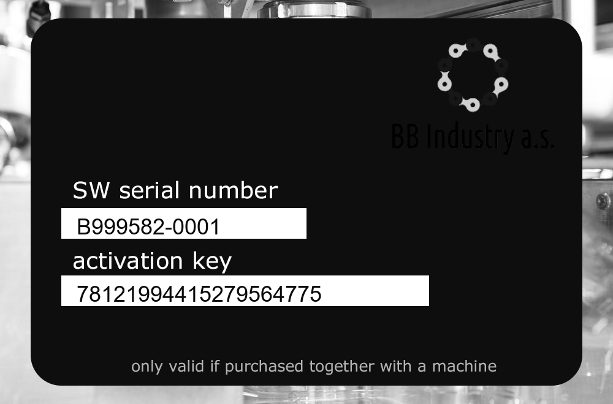

# Stolen licenses (300 points)

## Description

We found another file on the dark net! It seems that cyber criminals stole some of our license keys and put them up for sale.

We tracked down a ZIP file at https://use01.thegood.cloud/s/ncWkZGcskTEDpGe (password for download syskron.CTF2020).

We don't know the password of the ZIP file, but maybe it is weak encryption that can be easily cracked. If you find any valid license key, let us know.

## Solution

The archive consists of 1000 photos, but first you need to find a password for the zip archive. For this, we will use fcrackzip. First of all, let's try the rockyou wordlist.
```shell
$ fcrackzip -u -D -p ./rockyou.txt ./licenses.zip
```
To no avail, then we will use a 15GB wordlist [(link to wordlist)](https://crackstation.net/crackstation-wordlist-password-cracking-dictionary.htm).
It will take much longer (+-15 minuts for me), but during this time you can do other tasks.
```shell
$ fcrackzip -u -D -p ./crackstation.txt/realuniq.lst ./licenses.zip


PASSWORD FOUND!!!!: pw == nosocomephobia
```

Okay, now we have a password, you can see what kind of photos there are.



We need to find a valid key. Referring to the first tasks, where there was a mention of the Luhn algorithm for checking the validity, we will use this algorithm to check the keys, but first we need to get a list of keys. For this we will use the **tesseract**
```shell
$ tesseract B999582-0001.png stdout
Detected 10 diacritics
SW serial number

activation key

only valid if purchased together with a machine
```

Tesseract does not see the key. I decided to hardcode and change the colors of the pictures so that the tesseract can see the keys. For this I used python and the OpenCV library.
```python
import cv2

for i in range(1, 1001):
    img = 'B999582-{0:04}.png'.format(i)
    src = cv2.imread(img, cv2.IMREAD_UNCHANGED)
    green_channel = src[:,:,2]
    cv2.imwrite('res/{0:04}.png'.format(i), green_channel)
```
Now the pictures look like this:


```shell
$ tesseract res/0001.png stdout
Warning: Invalid resolution 0 dpi. Using 70 instead.
Estimating resolution as 333
oe eee

SW serial number

B999582-0001

activation key

78121994415279564775

only valid if purchased together with a machine
```
Works fine. Let's write a small bash script to get a list of keys
```shell
$ for i in {0001..1000}; do tesseract res/$i.png stdout | grep -x -E '[0-9]{20}'; done >> keys.txt
```
Now that we have a list of all the keys, I wrote a script on node.js that checks the keys using the above algorithm
```javascript
const Luhr = require('luhn-js');
const fs = require('fs');

const data = fs.readFileSync('./keys.txt', 'utf-8').split('\n');

data.forEach(key => Luhr.isValid(key) ? console.log(key) : null);
```
```shell
$ node valid.js
78124512846934984669
```

Flag: 78124512846934984669
