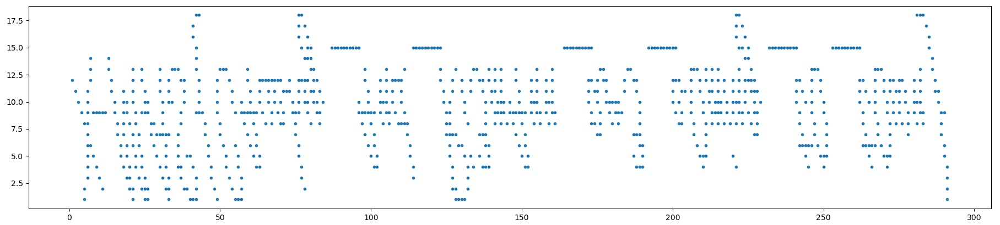
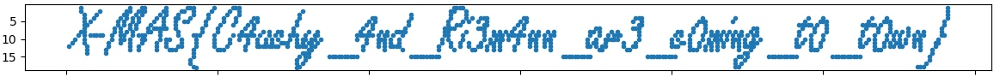

# Santa's ELF holomorphing machine (500 points)

## Description

We have intercepted the blueprints and a memory dump for another of Santa's wicked contraptions. What is the old man hiding this time around?

Author: PinkiePie1189

[data](data.txt)

[blueprint](blueprint.pdf)


## Solution

The solution is [**here**](https://en.wikipedia.org/wiki/Holomorphic_function)

We just need to draw the plot using the Cauchy-Riemann condition.

```python
import matplotlib.pyplot as plt
import re

data = open('data.txt', 'r') 
lines = data.readlines() 

x = []
y = []
for line in lines:
    parsed = re.findall(r"[-+]?\d*\.?\d+|[-+]?\d+", line)
    parsed = list(map(float,parsed))

    uOrV = line[0]
    firstMult = int(parsed[0])
    secondMult = int(parsed[1])
    currX = parsed[2]
    currY = parsed[3] 

    zx = 0
    zy = 0

    if (uOrV == 'u'):
        zx = firstMult * currX + secondMult * currY
        zy = firstMult * currY - secondMult * currX
    else:
        zy = firstMult * currX + secondMult * currY
        zx = secondMult * currX - firstMult * currY


    x.append(zx)
    y.append(zy)

plt.plot(x, y, '.')
plt.show()
```



Looks like flag, but we need to flip the plot: 

```python
plt.gca().invert_yaxis()
```



Flag: X-MAS{C4uchy_4nd_Ri3m4nn_ar3_c0ming_t0_t0wn}